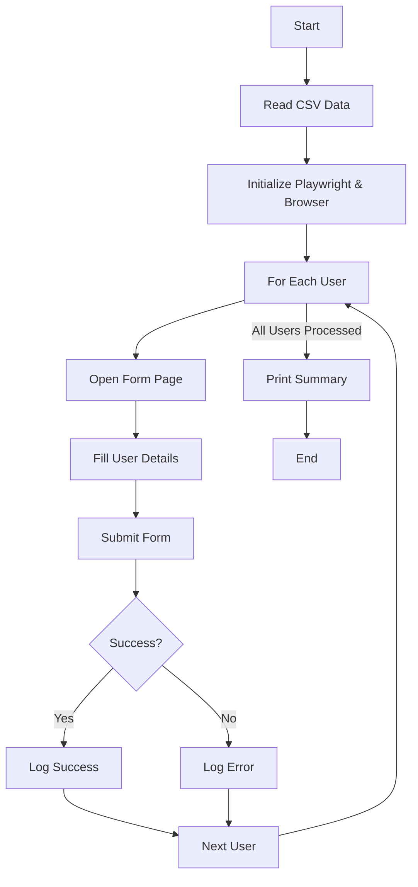

# Doerz Tech

Automated Web Form Submission with Playwright & Python
---

## 📋 Overview

This project automates the process of submitting web forms for multiple users using data from a CSV file. It leverages Python's Playwright for browser automation, with a modular structure for maintainability and extensibility.

---

## 🏗️ Architectural Framework

**Key Components:**
- **main.py**: Orchestrates the automation process, handles CSV reading, and manages the overall workflow.
- **pages/form_page.py**: Encapsulates all interactions with the web form (page object model).
- **utils/utils.py**: Provides utility functions, including logging setup.
- **data/user_data.csv**: Example user data for bulk submissions.
- **tests/**: Contains unit and integration tests for core logic and page interactions.

**Directory Structure:**
```
doerz_automation/
│
├── main.py
├── requirements.txt
├── data/
│   └── user_data.csv
├── pages/
│   └── form_page.py
├── utils/
│   └── utils.py
├── tests/
│   ├── test_main.py
│   ├── test_form_page.py
│   └── test_utils.py
└── README.md
```

---

## 🔄 Process Flow



---

## ⚙️ How It Works

1. **CSV Input**: Reads user data from a CSV file (`data/user_data.csv`).
2. **Browser Automation**: Uses Playwright to open a browser and navigate to the form page.
3. **Form Filling**: For each user, fills out the form fields and submits.
4. **Logging**: Logs each step, including successes and errors.
5. **Summary**: Prints a summary of all submissions at the end.

---

## 🚀 Getting Started

### 1. **Clone the Repository**
```bash
git clone https://github.com/yourusername/doerz_automation.git
cd doerz_automation
```

### 2. **Set Up Python Environment**
It is recommended to use a virtual environment:
```bash
python -m venv venv
source venv/bin/activate  # On Windows: venv\Scripts\activate
```

### 3. **Install Dependencies**
```bash
pip install -r requirements.txt
```
*You will also need Playwright browsers:*
```bash
python -m playwright install
```

### 4. **Prepare Your Data**
Edit `data/user_data.csv` with your user information.

### 5. **Run the Automation**
```bash
python main.py --csv_path data/user_data.csv --url https://your-form-url.com/
```
*You can also use the default values by simply running:*
```bash
python main.py
```

---

## 🧪 Running Tests

```bash
pytest tests/
```

---

## 🛠️ Customization

- **Form Structure**: Update `pages/form_page.py` if your form fields change.
- **Logging**: Adjust logging settings in `utils/utils.py`.
- **CSV Columns**: Ensure your CSV matches the expected columns: `First_Name,Last_Name,Email,Desired_Role`.

---
